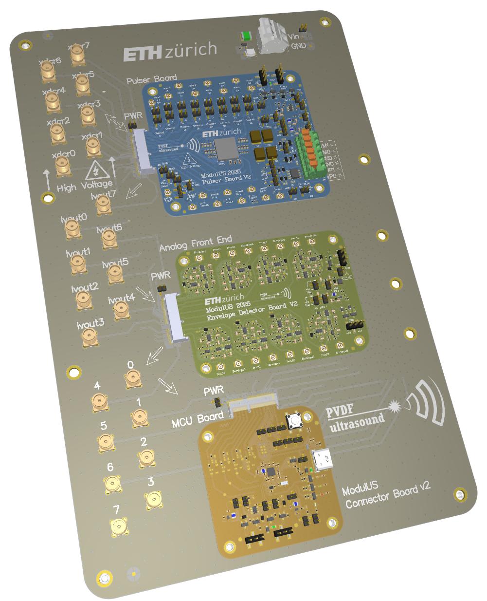
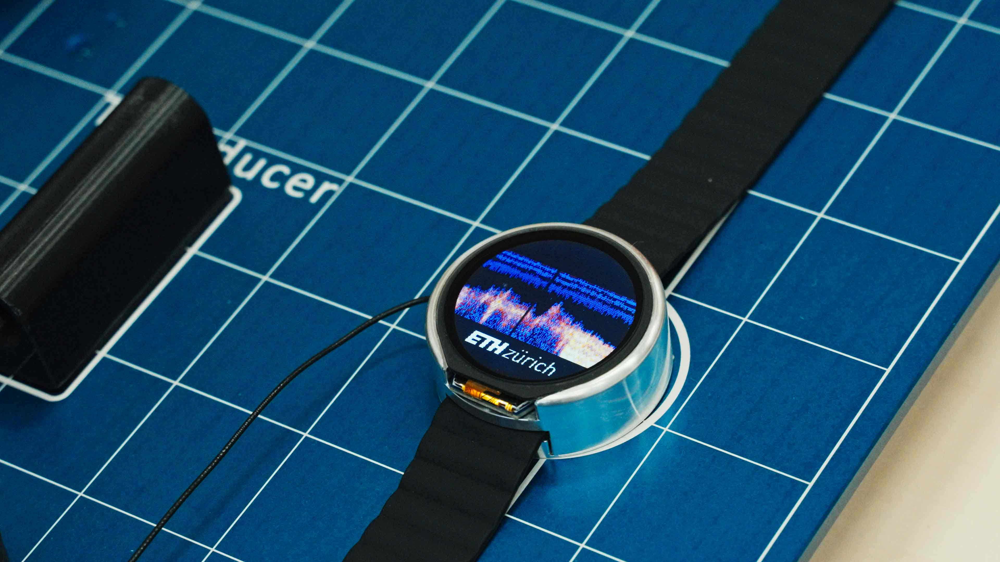

#  ModularUS

**Modular ultrasound systems and algorithms.** 
Open hardware, firmware, software, and intelligence for wearable and research ultrasound.

<table>
<tr>
<td></td>
<td></td>
</tr>
</table>

From sandbox to wearable: the ModulUS design platform (left) and WatchUS, the team's wrist-worn ultrasound device (right). Photo right: Marvin Thiel, mtvisuals.

## What this is

ModularUS grows out of **ModulUS**, the modular design platform for wearable ultrasound we introduced at the IEEE International Ultrasonics Symposium ([Leitner et al., IEEE IUS 2025](https://doi.org/10.1109/IUS62464.2025.11201551)): a sandbox that exposes the pulser, the analog front-end, and the control and compute unit as swappable modules, so that every layer of a wearable ultrasound system can be developed, characterised, and exchanged independently. **ModularUS** extends that idea from a single platform to an ecosystem, hosting the design platforms, tools, and measurement assets used to architect wearable ultrasound systems before they shrink into a wearable form factor, a role complementary to the wearable device platforms themselves ([Kupsch et al., *Nature Sensors*, 2026](https://doi.org/10.1038/s44460-026-00118-z)). We build these instruments to measure how the human body turns activation into motion, from printed piezoelectric films on the skin to systems worn in daily movement.

## Start here

| If you want to | Open |
|---|---|
| Learn how to build wearable ultrasound system electronics: how frequency, channels, and data representation set the power budget | [anatomy-wearable-US-system](https://github.com/ModularUS/anatomy-wearable-US-system), guided Colab exercises |
| Simulate a piezoelectric transducer stack | [xMasonV2](https://github.com/ModularUS/xMasonV2), YAML in, impedance and resonances out |
| Beamform plane-wave ultrasound data | [dasIT](https://github.com/ModularUS/dasIT), Python with a Colab sandbox |

## Repositories

Core repositories are built and maintained here. Forks aggregate results from our research and stay on the accounts of the students and collaborators who built them, unchanged.

| Repository | Layer | Origin | What it is | Reference |
|---|---|---|---|---|
| [xMason](https://github.com/ModularUS/xMason) | Transducers | core | First-generation adapted Mason model for fully printed transducers, superseded by xMasonV2 | [Leitner et al., IEEE ISAF 2022](https://doi.org/10.1109/ISAF51494.2022.9870126) |
| [xMasonV2](https://github.com/ModularUS/xMasonV2) | Transducers | core | Transfer-matrix simulation framework for multilayer piezoelectric ultrasound transducers | [Spisani et al., IEEE IUS 2025](https://doi.org/10.1109/IUS62464.2025.11201533) · [DOI 10.5281/zenodo.22117703](https://doi.org/10.5281/zenodo.22117703) |
| [RXcroc](https://github.com/ModularUS/RXcroc) | Circuits & systems | fork | IC design: high-throughput ultrasound acquisition pipeline for the Croc RISC-V SoC | |
| [U-Sonic](https://github.com/ModularUS/U-Sonic) | Circuits & systems | fork | IC design: synthesizable multi-channel ultrasound pulser IP for the Croc RISC-V SoC, taped out in IHP 130 nm | [ETH IIS chip gallery, 2026](http://asic.ethz.ch/2026/Pulser.html) |
| [UbpS](https://github.com/ModularUS/UbpS) | Firmware | fork | Continuous blood-pressure sensing on an ultrasound IoT node, code and data | |
| [Ultrasound-Heart-Rate](https://github.com/ModularUS/Ultrasound-Heart-Rate) | Firmware | fork | PuLsE: wrist-worn ultrasound heart-rate monitoring | [Giordano et al., IEEE IoT Journal, 2025](https://doi.org/10.1109/JIOT.2025.3581380) |
| [dasIT](https://github.com/ModularUS/dasIT) | Software | core | Delay-and-sum beamformer for plane-wave ultrasound in Python, with a Colab sandbox | |
| [PEtracer](https://github.com/ModularUS/PEtracer) | Metrology | fork | PEtra: open polarisation-electric-field loop tracer for P(VDF-TrFE) transducer characterisation | [Wessner et al., IEEE UFFC-JS 2024](https://doi.org/10.1109/UFFC-JS60046.2024.10793576) |
| [anatomy-wearable-US-system](https://github.com/ModularUS/anatomy-wearable-US-system) | Education | core | Guided Colab exercises on wearable ultrasound system design, built around the ModulUS digital twin | colab: [DOI 10.5281/zenodo.21023566](https://doi.org/10.5281/zenodo.21023566), slides [DOI 10.5281/zenodo.21030966](https://doi.org/10.5281/zenodo.21030966) |

Each repository carries its layer as a GitHub topic tag: [`transducers`](https://github.com/orgs/ModularUS/repositories?q=topic%3Atransducers), [`circuits-systems`](https://github.com/orgs/ModularUS/repositories?q=topic%3Acircuits-systems), [`firmware`](https://github.com/orgs/ModularUS/repositories?q=topic%3Afirmware), [`software`](https://github.com/orgs/ModularUS/repositories?q=topic%3Asoftware), [`metrology`](https://github.com/orgs/ModularUS/repositories?q=topic%3Ametrology), [`education`](https://github.com/orgs/ModularUS/repositories?q=topic%3Aeducation). Filtering by tag on the [repositories tab](https://github.com/orgs/ModularUS/repositories) gives the complete, current list as the organisation grows.

## Across the field

Open wearable and research ultrasound projects by other groups, at their own homes. Ordered from wearable devices to tools.

| Project | Category | Home | What it is |
|---|---|---|---|
| [WULPUS](https://github.com/pulp-bio/wulpus) | Wearable probe | ETH Zurich (pulp-bio) | Ultra-low-power wearable ultrasound probe |
| [TinyProbe](https://github.com/pulp-bio/TinyProbe) | Wearable probe | ETH Zurich (pulp-bio) | 32-channel multimodal wireless ultrasound probe |
| [un0rick](https://github.com/kelu124/un0rick) | Pulse-echo platform | Luc Jonveaux (kelu124) | Single-board ultrasound hardware (ice40 / Raspberry Pi) |
| [lit3rick](https://github.com/kelu124/lit3rick) | Pulse-echo platform | Luc Jonveaux (kelu124) | up5k pulse-echo acquisition board |
| [pic0rick](https://github.com/kelu124/pic0rick) | Pulse-echo platform | Luc Jonveaux (kelu124) | RP2040-based pulse-echo acquisition platform |
| [Open-LIFU](https://github.com/OpenwaterHealth/openlifu-electrical) | Therapeutic ultrasound | Openwater (OpenwaterHealth) | Open focused-ultrasound platform for neuromodulation, hardware through software |
| [open-UST](https://github.com/morganjroberts/open-UST) | Transducer manufacturing | UCL (morganjroberts) | Manufacturing framework for a 256-element ultrasound tomography ring array |

## Why modular

Two architectural templates dominate wearable ultrasound today, MCU-based systems with few receive channels and FPGA-based systems with higher channel counts ([Leitner et al., IEEE IUS 2025](https://doi.org/10.1109/IUS62464.2025.11201551)). Normalising the power per receive channel to the excitation frequency makes the two comparable across operating points. PuLsE, developed on ModulUS, holds the lowest reported value, 5.8 mW per receive channel and 0.6 mW/MHz ([Giordano et al., IEEE IoT Journal, 2025](https://doi.org/10.1109/JIOT.2025.3581380)).

| Platform | Topology | Rx channels | Volume [cm³] | Power / Rx [mW] | Excitation f [MHz] | Power / Rx / f [mW/MHz] |
|---|---|---|---|---|---|---|
| WULPUS (Frey et al., IEEE IUS 2022) | MCU | 1 | 14.95 | 22 | 4 | 5.5 |
| USoP (Lin et al., *Nat. Biotechnol.* 2024) | MCU | 1 | 16.2 | 614 | 6 | 102.3 |
| TinyProbe (Vostrikov et al., IEEE T-UFFC 2025) | FPGA | 32 | 39.9 | 30.3 | 15 | 2.0 |
| **PuLsE** ([Giordano et al., IEEE IoT Journal, 2025](https://doi.org/10.1109/JIOT.2025.3581380)) | MCU | 1 | 12.6 | 5.8 | 10 | **0.6** |

Data from Table I of [Leitner et al., IEEE IUS 2025](https://doi.org/10.1109/IUS62464.2025.11201551), which carries the full sources and measurement conditions.

## About

**Governance.** How repositories are added and maintained: [GOVERNANCE.md](https://github.com/ModularUS/.github/blob/main/GOVERNANCE.md)

**Licensing.** Hardware: Solderpad 2.1. Software and firmware: Apache-2.0. Documentation and data: CC-BY-4.0. Forks keep their upstream licenses.

**Contact.** Open an issue in the relevant repository.

## References

- C. Leitner, M. Giordano, M. Tanner, F. Villani, M. Magno, and L. Benini, "ModulUS: A Sandbox for High-Resolution Wearable Ultrasound Development," *IEEE International Ultrasonics Symposium (IUS)*, 2025. [doi:10.1109/IUS62464.2025.11201551](https://doi.org/10.1109/IUS62464.2025.11201551)
- C. Kupsch, C. Leitner, L. Benini, and D. Weik, "Translating wearable ultrasound with system integration and enabling technologies," *Nature Sensors*, 2026. [doi:10.1038/s44460-026-00118-z](https://doi.org/10.1038/s44460-026-00118-z)
- M. Giordano, C. Leitner, C. Vogt, L. Benini, and M. Magno, "PuLsE: Accurate and Robust Ultrasound-Based Continuous Heart-Rate Monitoring on a Wrist-Worn IoT Device," *IEEE Internet of Things Journal*, 2025. [doi:10.1109/JIOT.2025.3581380](https://doi.org/10.1109/JIOT.2025.3581380)
- M.-A. Wessner, F. Villani, S. Papa, K. Keller, L. Ferrari, F. Greco, L. Benini, and C. Leitner, "PEtra: A Flexible and Open-Source PE Loop Tracer for Polymer Thin-Film Transducers," *IEEE Ultrasonics, Ferroelectrics, and Frequency Control Joint Symposium (UFFC-JS)*, 2024. [doi:10.1109/UFFC-JS60046.2024.10793576](https://doi.org/10.1109/UFFC-JS60046.2024.10793576)
- G. Spisani, P. Mayer, S. Papa, F. Greco, M. Magno, L. Benini, and C. Leitner, "xMasonV2: An Open-Source Model Extension for Cascaded Transducer Arrays," *IEEE International Ultrasonics Symposium (IUS)*, 2025. [doi:10.1109/IUS62464.2025.11201533](https://doi.org/10.1109/IUS62464.2025.11201533)
- C. Leitner, K. Keller, S. Thurner, C. Baumgartner, F. Greco, H. Scharfetter, and J. Schröttner, "Design Automation for a Fully Printed P(VDF-TrFE) Transducer," *IEEE International Symposium on Applications of Ferroelectrics (ISAF)*, 2022. [doi:10.1109/ISAF51494.2022.9870126](https://doi.org/10.1109/ISAF51494.2022.9870126)
